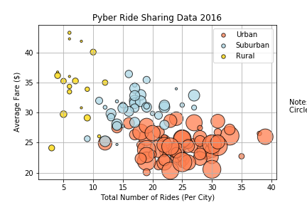
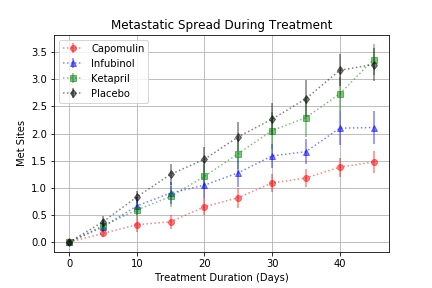
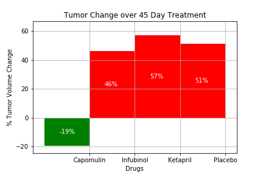

# Pyber - Ride Sharing
## Observable Trends
* Urban cities have the highest number of rides and drivers but the lowest average fares
* Rural cities, on the other hand have the lowest number of rides and cities but the highest average fares
* If the comapany is looking for the best potential total fares they should expand into the Urban areas but if the are concerned about maximizing their profits per drive and driver, the Rural cities are a great place to start investing with the Suburban market a nice alternative.

# Pymaceuticals
## Observable Trends
* The tumor volume decreased over time for Capomulin, but increase for Infubinol, Ketapril, and Placebo at similar rates.

* Metestatic spreads for all the drugs were somewhat lower than the Placebo, with Ketapril, Infubinol, and Capomulin becoming progressively more effective and reducing the spreading.

* Only Capomulin distanced itself from the Placebo when comparing survival rates.

* When comparing the Tumor change in a 45 day period it becomes increasingly clear that only Capomulin decreased the Tumor size while Infubinol and Ketapril had similar changes to the placebo.

