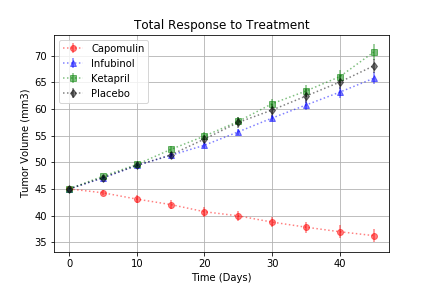
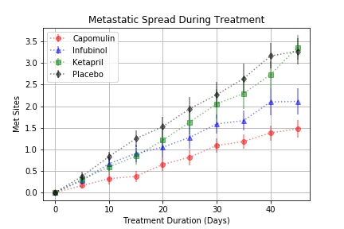
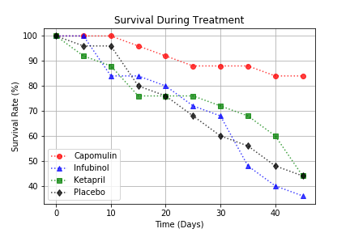
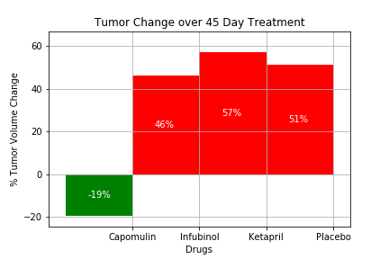

# Pymaceuticals
## Observable Trends
* The tumor volume decreased over time for Capomulin, but increase for Infubinol, Ketapril, and Placebo at similar rates.

* Metestatic spreads for all the drugs were somewhat lower than the Placebo, with Ketapril, Infubinol, and Capomulin becoming progressively more effective and reducing the spreading.

* Only Capomulin distanced itself from the Placebo when comparing survival rates.

* When comparing the Tumor change in a 45 day period it becomes increasingly clear that only Capomulin decreased the Tumor size while Infubinol and Ketapril had similar changes to the placebo.

